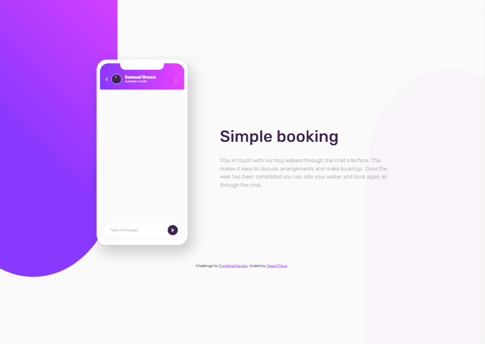

# Frontend Mentor - Chat app CSS illustration solution

This is a solution to the [Chat app CSS illustration challenge on Frontend Mentor](https://www.frontendmentor.io/challenges/chat-app-css-illustration-O5auMkFqY). Frontend Mentor challenges help you improve your coding skills by building realistic projects. 

## Table of contents

- [Overview](#overview)
  - [The challenge](#the-challenge)
  - [Screenshot](#screenshot)
  - [Links](#links)
- [My process](#my-process)
  - [Built with](#built-with)
  - [What I learned](#what-i-learned)
  - [Continued development](#continued-development)
  - [Useful resources](#useful-resources)
- [Author](#author)
- [Acknowledgments](#acknowledgments)

## Overview

### The challenge

Users should be able to:

- View the optimal layout for the component depending on their device's screen size
- **Bonus**: See the chat interface animate on the initial load

### Screenshot

### Links

- Solution URL: [solution on github](https://github.com/pawelpikus/chat-app-illustration)
- Live Site URL: [live site on github pages](https://pawelpikus.github.io/chat-app-illustration/)

## My process

### Built with

- Semantic HTML5 markup
- CSS custom properties
- CSS animations
- Flexbox

### What I learned

I've practiced flexbox which turned out to be a vary flexible tool for layouts:) Learned a bit about animations with @keygrames as well. 

### Continued development

Beware CSS Grid, I'm coming! 

## Author

- Website - [Paweł Pikus on github](https://github.com/pawelpikus)
- Frontend Mentor - [@pawelpikus](https://www.frontendmentor.io/profile/pawelpikus)
- Twitter - [@pavelpikus](https://www.twitter.com/pavelpikus)

## Acknowledgments

As always, thank you frontendmentor.io for keeping me challenged!

